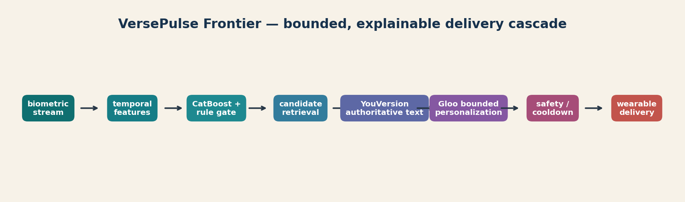

# VersePulse Frontier

VersePulse Frontier is a wearable-first Scripture experience built for the
Kaggle **Scripture in New Frontiers** challenge. It detects meaningful workout
transitions from current and past biometric observations, retrieves a compatible
Scripture reference, and keeps authoritative Scripture separate from bounded,
safety-checked encouragement.



## What is included

- `kernel.py` — the complete deterministic implementation used for the recorded run.
- `public_notebook.ipynb` — an explanatory notebook for the validation and safety evidence.
- `demo/` — a self-contained browser replay with no external CDN.
- `metrics.json` and `fold_metrics.csv` — grouped out-of-fold technical evidence.
- `api_contract_report.json` and `safety_eval.json` — API-boundary and safety checks.
- `live_api_status.json` — secret-free live-validation status and the Gloo billing limitation.
- `cover.png` and `evaluation_dashboard.png` — submission media.

No API credentials, Kaggle credentials, private data, or organizer data are
stored in this repository.

## Reproduce

Use Python 3.11+ and the repository's `uv` environment:

```bash
uv sync
KAGGLEBOT_DATA_DIR=/path/to/organizer-files \
KAGGLEBOT_OUTPUT_DIR=/tmp/versepulse-output \
uv run python showcase/scripture-in-new-frontiers/kernel.py
```

The organizer directory is expected to contain the challenge-provided biometric
CSV, verse-movement mapping CSV, sample notebook, and sample submission. The
implementation discovers those files by schema rather than requiring credentials
or absolute paths.

The latest recorded run used Leave-One-Session-Out validation across three
deterministic seeds. Its technical champion achieved grouped macro-F1 `0.6927`.
The independently selected conservative deployment route scored `0.6354`;
retrieval achieved Recall@3 `0.5972` and MRR@3 `0.4282`. These are offline
technical proxies, not an official judge score.

## API and safety boundary

YouVersion remains the authority for canonical Scripture. A secret-free final
check successfully called its live Bibles and passage endpoints and retrieved
John 3:16 from the BSB; see `live_api_status.json`. The application key was used
ephemerally and is not stored in this repository.

Gloo could not be validated live: Stripe rejected every available credit card,
so the workspace could not be activated and API credentials could not be issued
before the deadline. The repository therefore claims only its offline adapter and
20/20 contract tests for Gloo. It does **not** claim dual-live-API completion.
Replay output remains explicitly labeled and is never presented as live proof.

Open `demo/index.html` locally to inspect the product replay and its auditable
decision trail.

## Public submission

- [Kaggle writeup](https://www.kaggle.com/competitions/scripture-in-new-frontiers/writeups/versepulse-frontier)
- [Kaggle notebook](https://www.kaggle.com/code/moeuuu/versepulse-frontier-reproducibility-and-evidence)
- [Working demo](https://versepulse-frontier-2026.moeu0710.chatgpt.site/demo)
- [Three-minute video](https://youtu.be/ks5ztaaN5xA)
